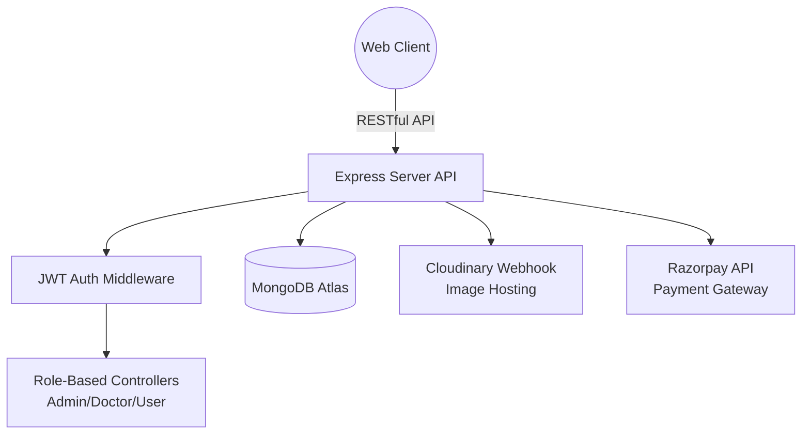

<div align="center">


# 🏥 HealthAxis Enterprise

### **Next-Generation Full-Stack Healthcare Operations Platform**
#### *Seamlessly connecting Patients, Doctors, and Administrators with a unified, real-time ecosystem.*

[](https://health-axis-five.vercel.app)
[](#)
[](#)
[](#)

*HealthAxis is a highly scalable, securely authenticated MERN stack application designed to handle high-volume clinical operations, from discovery and robust scheduling to dynamic payment processing.*

</div>

---

## 📖 Table of Contents

- [🎥 Live Demo & Video Walkthrough](#-live-demo--video-walkthrough)
- [✨ Core Capabilities](#-core-capabilities)
- [🏗️ High-Level Architecture](#-high-level-architecture)
- [📸 Application Showcase](#-application-showcase)
  - [Patient Experience](#patient-experience)
  - [Doctor Workflow](#doctor-workflow)
  - [Administrative Control](#administrative-control)
- [🛠️ Technical Stack & Integrations](#️-technical-stack--integrations)
- [⚙️ System Design highlights](#️-system-design-highlights)
- [🚀 Quick Start Guide](#-quick-start-guide)
- [🔐 Environment Variables](#-environment-variables)
- [📈 Future Roadmap](#-future-roadmap)
- [🤝 About the Developer](#-about-the-developer)

---

## 🎥 Live Demo & Video Walkthrough

Experiencing the platform is the best way to understand its power.

### 🌐 [Click Here to Access the Live Platform](https://health-axis-five.vercel.app)

### 🎬 Full Project Walkthrough Video
*(Replace the URL and Video ID below with your actual demo platform like YouTube or Loom)*

<div align="center">
  <a href="https://youtu.be/YOUR_VIDEO_ID_HERE" target="_blank">
    
  </a>
  <p><i>Click the thumbnail above to watch the comprehensive 10-minute deep dive into the architecture and user flows.</i></p>
</div>

---

## ✨ Core Capabilities

HealthAxis is segmented into three distinct dashboards, completely decoupled logically but integrated visually to provide a unified user experience.

### 🙍 Patient Workspace
- **Smart Discovery**: Advanced filtering of doctors based on specialty, availability, and fees.
- **Real-Time Booking**: Frictionless calendar interface preventing double-booking and timezone conflicts.
- **Secure Financials**: Complete **Razorpay** checkout integration for immediate appointment confirmations.
- **Health Dashboard**: Centralized view of upcoming, completed, and canceled appointments.

### 👨‍⚕️ Doctor Workspace
- **Revenue & Schedule Management**: Dedicated KPI dashboard showing daily earnings, total patients, and upcoming slots.
- **Dynamic Profile Editing**: Update consulting fees, availability metrics, and profile imagery via **Cloudinary**.
- **Actionable Appointments**: 1-click accept/cancel mechanism triggering instant database updates.

### 🛡️ Administrative Control
- **God-Mode Dashboard**: High-level metrics tracking total doctors, patients, appointments, and overall platform health.
- **Onboarding Pipeline**: Secure endpoints to add and verify new medical professionals.
- **Oversight**: Total visibility into the transaction and appointment streams across the entire organization.

---

## 🏗️ High-Level Architecture

The platform utilizes a modern decoupled architecture, ensuring scalability and ease of maintenance.



---

## 📸 Application Showcase

> *A curated look at the pixel-perfect, responsive UI designed with Tailwind CSS.*

### Patient Experience

<table align="center" style="width:100%; text-align:center;">
  <tr>
    <td align="center" width="50%">
      <b>🏠 Intelligent Home Dashboard</b><br>
      
    </td>
    <td align="center" width="50%">
      <b>👨‍⚕️ Doctor Directory & Filtering</b><br>
      
    </td>
  </tr>
  <tr>
    <td align="center" width="50%">
      <b>📅 Frictionless Booking Interface</b><br>
      
    </td>
    <td align="center" width="50%">
      <b>💳 Secure Razorpay Checkout</b><br>
      
    </td>
  </tr>
    <tr>
    <td align="center" width="50%">
      <b>📋 Patient Appointment History</b><br>
      
    </td>
    <td align="center" width="50%">
      <b>👤 Patient Profile Management</b><br>
      
    </td>
  </tr>
</table>

### Doctor Workflow

<table align="center" style="width:100%; text-align:center;">
  <tr>
    <td align="center" width="50%">
      <b>📊 Analytics Dashboard</b><br>
      
    </td>
    <td align="center" width="50%">
      <b>📋 Schedule & Approvals</b><br>
      
    </td>
  </tr>
</table>

### Administrative Control

<table align="center" style="width:100%; text-align:center;">
  <tr>
    <td align="center" width="33%">
      <b>📊 Global Command Center</b><br>
      
    </td>
    <td align="center" width="33%">
      <b>➕ Secure Doctor Onboarding</b><br>
      
    </td>
    <td align="center" width="33%">
      <b>🗓️ Complete Platform Oversight</b><br>
      
    </td>
  </tr>
</table>

---

## 🛠️ Technical Stack & Integrations

<div align="center">

| Domain | Core Technology | Strategic Purpose |
| :--- | :--- | :--- |
| **Frontend** | React.js, Vite | Lightning-fast HMR, component-driven UI |
| **Styling** | Tailwind CSS | Utility-first, highly responsive design system |
| **Backend API** | Node.js, Express.js | Non-blocking I/O event-driven RESTful architecture |
| **Database** | MongoDB, Mongoose | Flexible Document Schema, robust data relations (NoSQL) |
| **Security** | JWT, bcrypt.js, cors | Role-Based Access Control (RBAC) & encrypted payloads |
| **Payments** | Razorpay Node SDK | Compliant financial transaction gateway |
| **Media Delivery**| Cloudinary, Multer | Edge-optimized image transformations and hosting |
| **Deployment** | Vercel | CI/CD pipeline, Edge Network Delivery |

</div>

---

## ⚙️ System Design Highlights

1. **Role-Based Access Control (RBAC):** Middleware checks embedded across endpoints prevent horizontal and vertical privilege escalation. Only users with specific token payloads can access target routes.
2. **Atomic Payment Rollbacks:** Ensuring data integrity by linking the Razorpay `order_id` to the MongoDB document securely before prompting the client for payment.
3. **Stateless Authentication:** Utilizing HTTP-only cookies and Bearer tokens for a scalable authentication flow that requires zero session storage in the database.

---

## 🚀 Quick Start Guide

Spin up the entire ecosystem on your local machine in under **5 minutes**.

### Prerequisites
- **Node.js**: `v18.x` or higher
- **Package Manager**: `npm v9.x` or higher
- **Daemons**: A running local MongoDB instance OR MongoDB Atlas cluster URI.

### Step 1: Clone the Monorepo-style structure
```bash
git clone https://github.com/KartikeyaNainkhwal/HealthAxis.git
cd HealthAxis
```

### Step 2: Initialize the API (Backend)
```bash
cd backend
npm install
npm start
# 🚀 Backend ignites on http://localhost:4000
```

### Step 3: Initialize the Web Client (Patient Frontend)
*(In a new terminal)*
```bash
cd frontend
npm install
npm run dev
# 💻 Client launches on http://localhost:5173
```

### Step 4: Initialize the Portal (Admin/Doctor Frontend)
*(In a new terminal)*
```bash
cd admin
npm install
npm run dev
# 🛡️ Portal launches on http://localhost:5174
```

---

## 🔐 Environment Variables

The backend relies on strict environmental configurations. Create a `.env` file at `backend/.env` utilizing the template below:

```env
# ── Core Server Configuration ────────────────
PORT=4000
MONGODB_URI=mongodb+srv://<username>:<password>@cluster0.exmple.mongodb.net/healthaxis

# ── Security & Cryptography ──────────────────
JWT_SECRET=generate_a_strong_random_256_bit_string

# ── Global Administrative Credentials ────────
ADMIN_EMAIL=your_admin_email@example.com
ADMIN_PASSWORD=your_ultra_secure_password

# ── Cloudinary Media Delivery ────────────────
CLOUDINARY_NAME=your_cloudinary_namespace
CLOUDINARY_API_KEY=your_cloudinary_api_key
CLOUDINARY_SECRET_KEY=your_cloudinary_secret_key

# ── Financial Processing (Razorpay) ──────────
RAZORPAY_KEY_ID=your_razorpay_production_or_test_key
RAZORPAY_KEY_SECRET=your_razorpay_secret
```

---

## 📈 Future Roadmap

I treat my projects as living products. Upcoming features slated for development:
- [ ] **WebRTC Telemedicine Integration:** Real-time video consultations directly within the platform.
- [ ] **AI-Powered Symptom Checker:** Pre-screening bot using an LLM to recommend the correct specialist.
- [ ] **Push Notifications & Reminders:** SMS and WhatsApp integrations for appointment reminders via Twilio.
- [ ] **Prescription Generator:** Doctors can generate, securely sign, and send Digital Prescriptions (PDFs).

---

## 🤝 About the Developer

<div align="center">


Hey there! I'm **Kartikeya Nainkhwal**, a Full-Stack Engineer and MERN specialist who loves building mission-critical business applications. I architect solutions with a relentless focus on clean code, scalable infrastructure, and premium user experiences. 

**🔥 Available for Freelance & Full-Time Opportunities**

If you're looking for a developer who can own a product from *database design* to *production deployment*, **let's chat**.

[](https://github.com/KartikeyaNainkhwal)
[](mailto:youremail@example.com)

**If HealthAxis impressed you, I would deeply appreciate a ⭐ on the repository!**

</div>
